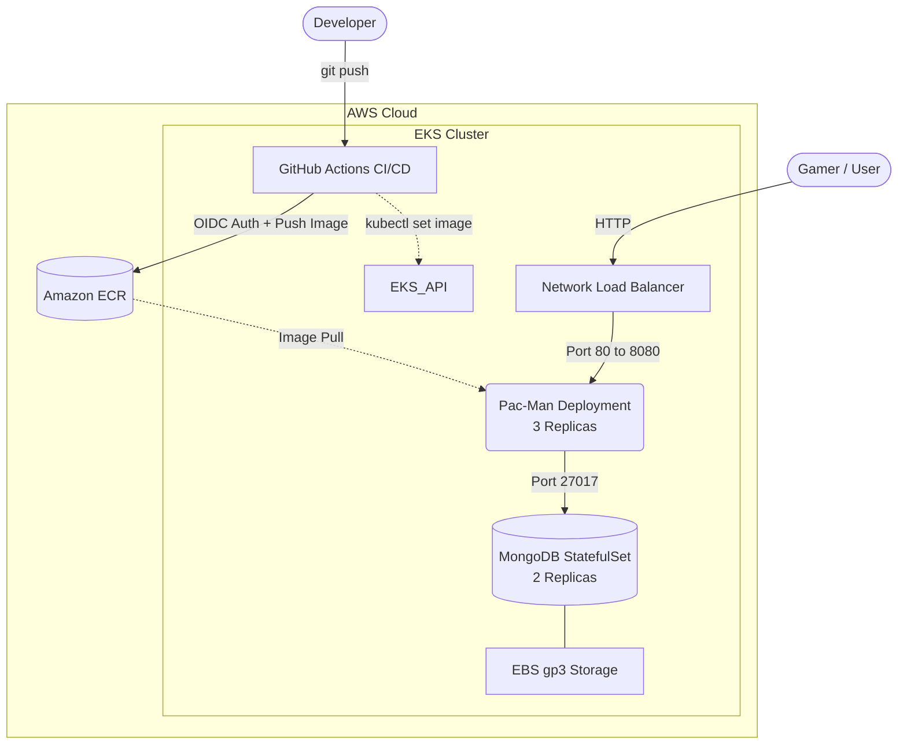

# 🚀 EKS Cloud-Native CI/CD Pipeline: Pac-Man Microservices

## 📑 Table of Contents
* [Overview](#-overview)
* [Cloud Architecture](#-cloud-architecture)
* [Tech Stack](#-tech-stack)
* [CI/CD Pipeline Workflow](#-cicd-pipeline-workflow)
* [Repository Structure](#-repository-structure)
* [How to Trigger the Deployment](#-how-to-trigger-the-deployment)
---

## 📌 Overview
This repository demonstrates a complete Cloud-Native deployment of a multi-tier web application (Pac-Man) on Amazon EKS. It features a fully automated CI/CD pipeline, passwordless AWS authentication via OIDC, and infrastructure provisioning using `eksctl` with Auto Mode.

## 🏗️ Cloud Architecture



## 🛠️ Tech Stack

* **Cloud Provider:** AWS (EKS, ECR, IAM, NLB, EBS)
* **Containerization:** Docker
* **Orchestration:** Kubernetes (Deployments, StatefulSets, Services, StorageClasses)
* **CI/CD:** GitHub Actions (OIDC Integration)
* **Database:** MongoDB

## 🔄 CI/CD Pipeline Workflow

* **Push:** Developer pushes code changes to the master branch.
* **Auth:** GitHub Actions authenticates securely with AWS using a short-lived OIDC token (eliminating the need for static access keys).
* **Build & Push:** A new Docker image is built, tagged with the unique Git Commit SHA ($GITHUB_SHA), and pushed to Amazon ECR.
* **Deploy:** The pipeline updates the EKS cluster using an imperative kubectl set image command, rolling out the new version dynamically with zero downtime.

## 📂 Repository Structure

* **.github/workflows/main_secure.yml:** The CI/CD pipeline definition.
* **ekscluster/cluster.yaml:** Infrastructure as Code (IaC) for EKS Auto Mode.
* **k8s/:** Kubernetes manifests (Deployment, StatefulSet, Services, gp3 StorageClass).

## ⚡ How to Trigger the Deployment

This project embraces true Continuous Deployment. To trigger the entire infrastructure update, build, and deployment process, simply commit and push your code to the master branch:

```bash
git commit -am "Update code"
git push origin master
```


